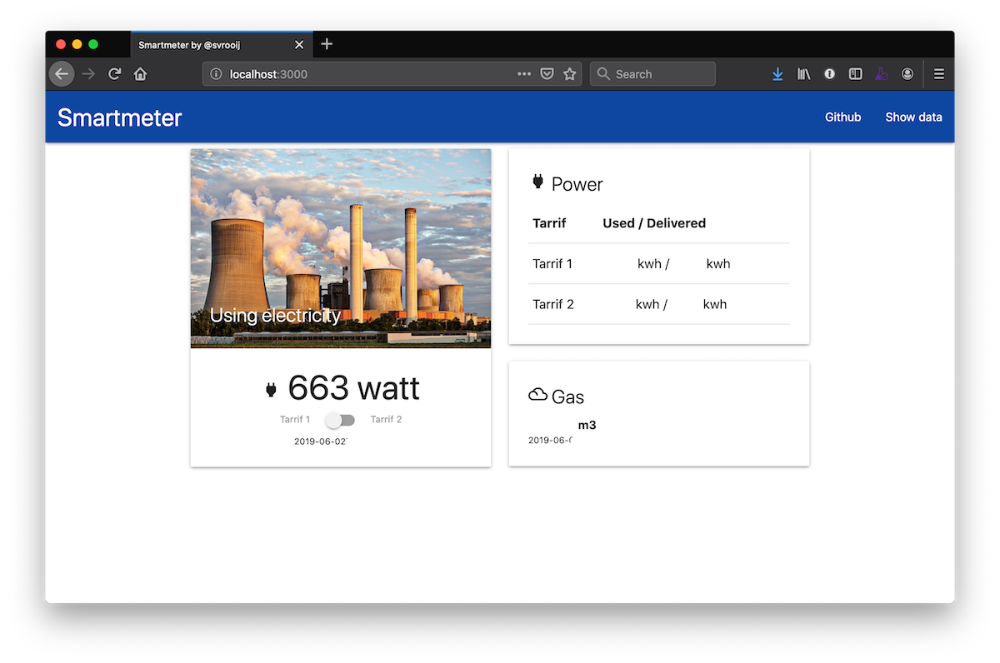

# Smartmeter2mqtt

[![Smartmeter2mqtt documentation][badge_smartmeter-docs]][link_smartmeter-docs]
[![npm][badge_npm]][link_npm]
[![docker pulls][badge_docker]][link_docker]
[![Support me on Github][badge_sponsor]][link_sponsor]

[![github issues][badge_issues]][link_issues]
[![Run tests and publish][badge_build]][link_build]
[![Coverage Status][badge_coveralls]][link_coveralls]
[](//github.com/semantic-release/semantic-release)

An application that parses smartmeter data over the network or a P1 cable.

## Key features

- Connect to smartmeter over [p1 cable](https://svrooij.io/smartmeter2mqtt/connect.html#2-p1-to-usb) or [p1-to-socket](https://svrooij.io/smartmeter2mqtt/connect.html#1-p1-to-tcp-socket) device.
- Parse DSMR data
- Website with real-time-data (over websockets)
- [Output socket](https://svrooij.io/smartmeter2mqtt/outputs/socket.html#raw-socket) to daisy-chain other applications
- [Decrypt](https://svrooij.io/smartmeter2mqtt/advanced/decryption.html) Luxemburg smartmeter data

## Documentation

Go to [smartmeter2mqtt documentation](https://svrooij.io/smartmeter2mqtt/) to get started really quickly.



## Docker

If you don't want to read the carefully made documentation, use one of the docker compose samples to get started quickly.
### Docker compose with socket

```yml
version: "3.7"

services:
  smartmeter:
    image: svrooij/smartmeter:latest
    restart: unless-stopped
    ports: # Depending on your situation you'll need to expose some ports
      - 3000:3000
      - 3010:3010
      - 3020:3020
    environment:
      - TZ=Europe/Amsterdam
      - SMARTMETER_SOCKET=192.168.1.15:23
      - SMARTMETER_web-server=3000
      - SMARTMETER_tcp-server=3010
      - SMARTMETER_raw-tcp-server=3020
      # - SMARTMETER_enc-key=056F9B0CFEDF150E889BEAD52FA7A174 # if you need to decrypt the messages
      # - SMARTMETER_sunspec-modbus=192.168.x.x # if you want to also read your solar inverter.
```

### Docker compose with usb

If you're reading from an USB to P1 cable, it's important that you connect the device to the container. The mapped location might change on reboot or if you connect other devices. That is why I recommend to connect the device by serial. You will need the real device location, type `ls /dev/serial/by-id` and note the device string that looks like `usb-FTDI_FT232R_USB_UART_A13LN4ZS-if00-port0` for my cable.

Be sure to replace this device id in the docker compose file.

```yml
version: "3.7"

services:
  smartmeter:
    image: svrooij/smartmeter:latest
    devices: # Replace the device id with your found id, the device is mapped as /dev/ttyUSB0 inside the container.
      - /dev/serial/by-id/usb-FTDI_FT232R_USB_UART_A13LN4ZS-if00-port0:/dev/ttyUSB0
    restart: unless-stopped
    ports: # Depending on your situation you'll need to expose some ports
      - 3000:3000
      - 3010:3010
      - 3020:3020
    environment:
      - TZ=Europe/Amsterdam
      - SMARTMETER_PORT=/dev/ttyUSB0
      - SMARTMETER_web-server=3000
      - SMARTMETER_tcp-server=3010
      - SMARTMETER_raw-tcp-server=3020
      # - SMARTMETER_enc-key=056F9B0CFEDF150E889BEAD52FA7A174 # if you need to decrypt the messages
      # - SMARTMETER_sunspec-modbus=192.168.x.x # if you want to also read your solar inverter.
```

[badge_build]: https://github.com/svrooij/smartmeter2mqtt/workflows/Run%20tests%20and%20publish/badge.svg
[badge_coveralls]: https://coveralls.io/repos/github/svrooij/smartmeter2mqtt/badge.svg?branch=master
[badge_docker]: https://img.shields.io/docker/pulls/svrooij/smartmeter?style=flat-square
[badge_issues]: https://img.shields.io/github/issues/svrooij/smartmeter2mqtt?style=flat-square
[badge_npm]: https://img.shields.io/npm/v/smartmeter2mqtt?style=flat-square
[badge_smartmeter-docs]: https://img.shields.io/badge/smartmeter-mqtt-blue?style=flat-square
[badge_sponsor]: https://img.shields.io/badge/Sponsor-on%20Github-red?style=flat-square

[link_build]: https://github.com/svrooij/smartmeter2mqtt/actions
[link_coveralls]: https://coveralls.io/github/svrooij/smartmeter2mqtt?branch=master
[link_docker]: https://hub.docker.com/r/svrooij/smartmeter
[link_issues]: https://github.com/svrooij/smartmeter2mqtt/issues
[link_npm]: https://www.npmjs.com/package/smartmeter2mqtt
[link_smartmeter-docs]: https://svrooij.io/smartmeter2mqtt
[link_sponsor]: https://github.com/sponsors/svrooij
