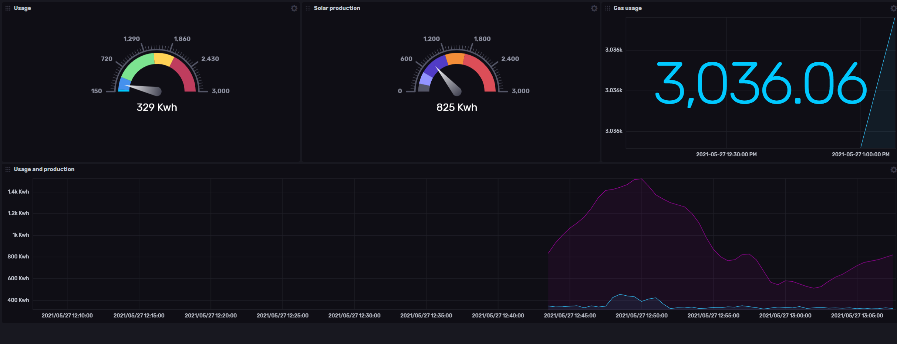

# Smartmeter2mqtt InfluxDB output

In the latest version we also support InfluxDB as an output. This means you can configure your own dashboards really easily.

## Configure InfluxDB

You will just have to configure the following options to have your usage data automatically uploaded to InfluxDB.

| Name | Argument | Environment prefix with `SMARTMETER_` | Description |
|:---- |:-------- |:------------------------------------- |:----------- |
| Influx url  | `--influx-url` | `influx-url` | Set this to the url you got from your Influx host |
| Influx token  | `--influx-token` | `influx-token` | Set this to the token you created, it has to have write access to the bucket |
| Influx organization  | `--influx-org` | `influx-org` | For local you can pick this yourself, for hosted it probably is your emailaddress |
| Influx bucket  | `--influx-bucket` | `influx-bucket` | The bucket where you want to store the readings |

## Dashboard

You can use the dashboard above by importing [this file](../assets/influxdb-house-usage.json) into influx.

## InfluxDB Cloud or local

You can host InfluxDB really easy inside [docker](https://hub.docker.com/_/influxdb) or create a free account at [Influxdata.com](https://www.influxdata.com/), pick whichever suits your needs.
